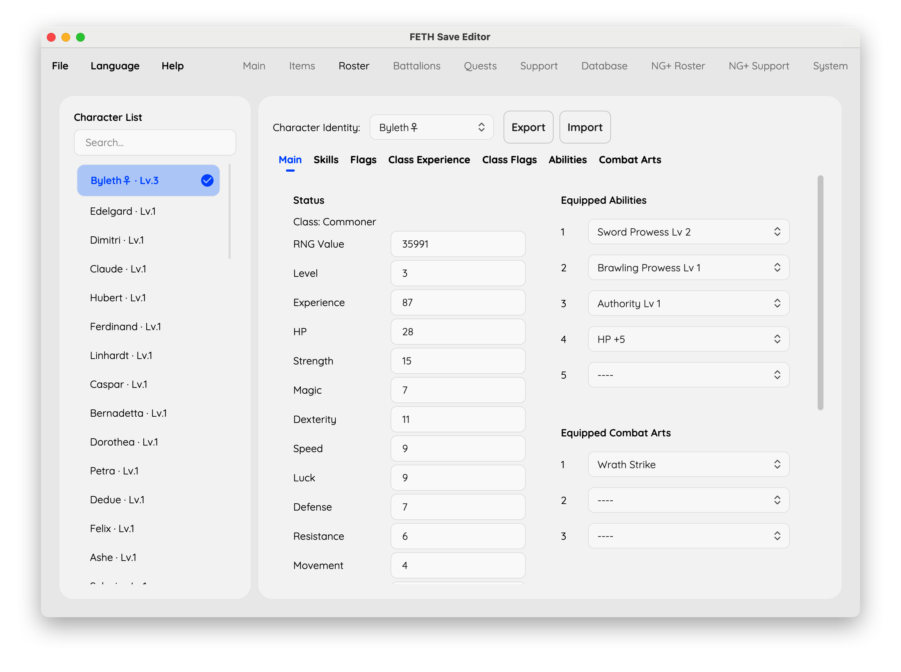

# FETH Save Editor

Edit Fire Emblem: Three Houses saves, including inherited New Game+ progress.



## Features

- **Main:** Edit player details, money, renown, professor experience and rank, activity points, goddess statues, game values, and monthly statistics. The inherited professor rank is available here too.
- **Items:** Edit inventory items and durability, restore durability to each item's normal maximum, sort the inventory, add essential items, and change miscellaneous item and gift quantities.
- **Roster:** Edit character stats, equipped abilities and combat arts, held items, skill experience, learned magic, flags, class experience and mastery, unlocked abilities and combat arts, and import or export individual characters.
- **Battalions:** Change battalion type, assigned character, experience, stamina, and skill; sort the list.
- **Quests:** Search quests and change their state.
- **Support:** Edit the current run's support ranks and underlying points.
- **Database:** Look up characters, classes, and items without changing the save.
- **NG+ Roster:** Edit inherited skill ranks and class mastery for each character, or unlock them in bulk.
- **NG+ Support:** Edit inherited support ranks and points separately from the current run.
- **System:** Edit save-slot and unlock flags in the system save found alongside the selected slot.

Switch languages from the top menu. The interface and game-data names use the selected language where translations are available.

## Get started

Download the GUI from the [latest release](https://github.com/jinghaihan/feth-save-editor/releases/latest), open a `slotXX` or `auto` save, make your edits, then save a copy to another folder. Keep your original save until you have checked the edited copy in-game. The editor targets Fire Emblem: Three Houses v1.2.0.

To run from source with the .NET 10 SDK:

```sh
dotnet run --project Gui/FethEditor.Gui.csproj -c Release
```

For scripted edits, see the [CLI guide](CLI.md).

## Credits

- [imouto1994/fe3h-editor](https://github.com/imouto1994/fe3h-editor): the original project this editor was derived from.
- [Falo's v1.2.0 Beta1 release](https://gbatemp.net/threads/fire-emblem-three-houses-general-hacking.544144/post-8948080): v1.2.0 save support and game data.

## License

[MIT](./LICENSE) License © [jinghaihan](https://github.com/jinghaihan) for my original contributions. The [upstream repository](https://github.com/imouto1994/fe3h-editor) has no license; this MIT license does not cover its code or assets.
