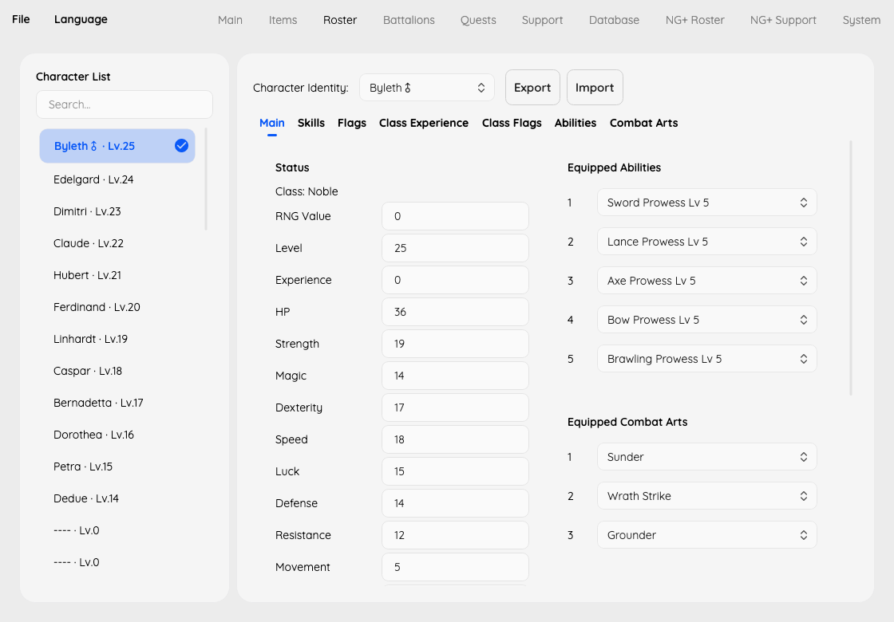

# FETH Save Editor

Edit Fire Emblem: Three Houses saves, including inherited New Game+ progress.

## What you can edit

- Current run: money, renown, items, characters, battalions, quests, and supports.
- NG+: inherited professor rank, character skills and class mastery, and supports.
- System save: unlock flags alongside the selected slot.



## Get started

Download the GUI from the [latest release](https://github.com/jinghaihan/feth-save-editor/releases/latest), open a `slotXX` or `auto` save, make your edits, then save a copy to another folder. Keep your original save until you have checked the edited copy in-game. The editor targets Fire Emblem: Three Houses v1.2.0.

To run from source with the .NET 10 SDK:

```sh
dotnet run --project Gui/FethEditor.Gui.csproj -c Release
```

For scripted edits, see the [CLI guide](CLI.md).

## Credits

- [imouto1994/fe3h-editor](https://github.com/imouto1994/fe3h-editor): the original project this editor was derived from.
- [Falo's v1.2.0 Beta1 release](https://gbatemp.net/threads/fire-emblem-three-houses-general-hacking.544144/post-8948080): v1.2.0 save support and game data.
